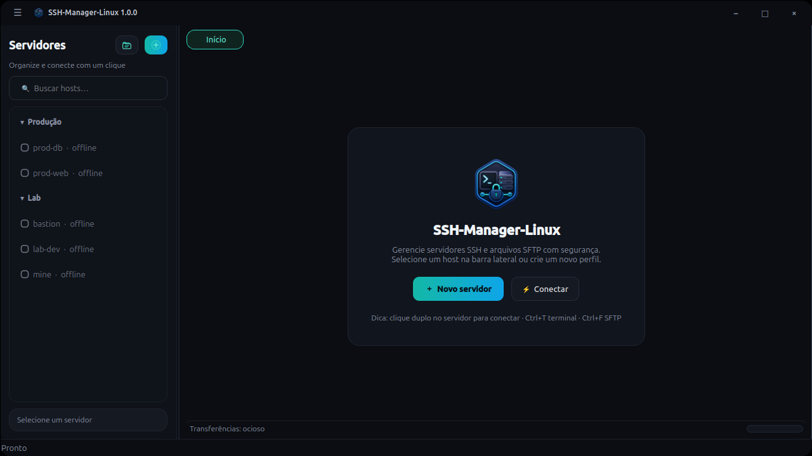

# SSH-Manager-Linux

<p align="center">
  
</p>

<p align="center">
  <strong>Gerenciador desktop de SSH e SFTP para Linux</strong><br>
  Terminal · Arquivos · Transferências · Perfis seguros
</p>

<p align="center">
  <a href="https://github.com/Niltonjuniornzx/SSH-Manager-Linux/actions/workflows/ci.yml"></a>
  
  
  
</p>

Cliente gráfico moderno (PySide6 + AsyncSSH), no espírito do Bitvise, nativo no desktop Linux  
(KDE, GNOME, X11 e Wayland).

---

## Screenshot

<p align="center">
  
</p>

<p align="center"><em>Tela inicial — servidores, grupos e menu ☰</em></p>

---

## Recursos

- **Servidores** com **grupos** (criar/editar/excluir), busca e jump host  
- **Keyring** do sistema (KDE Wallet / GNOME Keyring / Secret Service) — senhas fora do SQLite  
- **Host keys** validadas no handshake SSH **antes** de qualquer autenticação  
- Fingerprint SHA-256; bloqueio se a chave mudar; remoção manual em Configurações  
- **Terminal** PTY interativo (cores ANSI) + terminal externo opcional  
- **SFTP** dual-pane, drag-and-drop, confirmações e proteção contra path traversal  
- **Transferências** com progresso, cancelamento e download atômico  
- Import/export sem credenciais; backup opcional Argon2id + AES-256-GCM  
- Senha mestra com **Argon2id** e bloqueio por inatividade  

---

## Instalação (pelo GitHub)

### Um comando (recomendado)

```bash
git clone https://github.com/Niltonjuniornzx/SSH-Manager-Linux.git
cd SSH-Manager-Linux
bash install.sh
```

Isso instala em `~/.local/share/ssh-manager-linux`, cria o comando `ssh-manager-linux`  
e o **atalho no menu de aplicativos** com ícone.

### Abrir o app

- Pelo menu: procure **“SSH-Manager-Linux”**  
- Ou no terminal:

```bash
ssh-manager-linux
```

### Dependências de sistema (Ubuntu/Debian)

```bash
sudo apt install python3 python3-venv python3-pip openssh-client libsecret-1-0
```

### Arch / CachyOS

```bash
sudo pacman -S python openssh libsecret
```

### Desinstalar

```bash
bash uninstall.sh
# ou, se já instalou:
bash ~/.local/share/ssh-manager-linux/uninstall.sh
```

Perfis ficam em `~/.local/share/ssh-manager-linux/` (não são apagados pelo uninstall).  
Dados legados em `nzxs-remote-manager` são migrados automaticamente na primeira execução.  
Para remover tudo:

```bash
rm -rf ~/.local/share/ssh-manager-linux ~/.config/ssh-manager-linux ~/.cache/ssh-manager-linux
```

---

## Desenvolvimento

```bash
git clone https://github.com/Niltonjuniornzx/SSH-Manager-Linux.git
cd SSH-Manager-Linux
python3 -m venv .venv
source .venv/bin/activate
pip install -r requirements.txt
python main.py
```

### Testes

```bash
source .venv/bin/activate
pytest -q
ruff check app tests main.py
```

---

## Uso rápido

1. **Novo** — cadastre host, usuário e autenticação  
2. **Conectar** — confira a host key na primeira vez  
3. Abas da sessão: **Terminal** · **Arquivos SFTP**  

| Atalho | Ação |
|--------|------|
| `Ctrl+N` | Novo servidor |
| `Ctrl+Enter` | Conectar |
| `Ctrl+T` | Terminal |
| `Ctrl+F` | SFTP |
| `Ctrl+G` | Grupos |

---

## Ícones

Pacote de ícones em `assets/icons/` (16–512 px):

<p align="center">
  
  
  
</p>

---

## Empacotamento extra

```bash
./build_deb.sh        # pacote .deb
./build_appimage.sh   # AppImage / AppDir
```

---

## Estrutura

```
SSH-Manager-Linux/
├── main.py
├── install.sh / uninstall.sh
├── app/           # código
├── assets/icons/  # ícones
├── tests/
└── packaging/
```

---

## Segurança

- Senhas só no **keyring**  
- Host key com confirmação; bloqueio se mudar  
- Sem `shell=True` em processos externos  
- Logs sanitizados  

Mais detalhes: [SECURITY.md](SECURITY.md)

---

## Contribuir

Veja [CONTRIBUTING.md](CONTRIBUTING.md).

## Licença

[MIT](LICENSE) © NZXS / Nilton Junior
